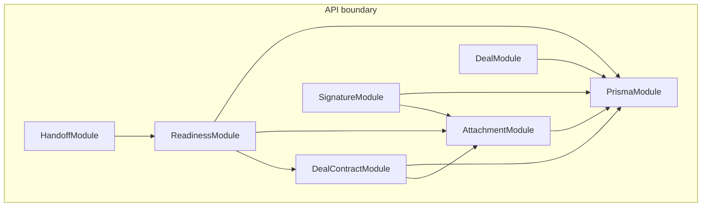

# Document core architecture — implementation map

**Version:** 1.0  
**Grounded in:** [DOCUMENT_CORE_SCHEMA_REVIEW_AND_REDESIGN.md](./DOCUMENT_CORE_SCHEMA_REVIEW_AND_REDESIGN.md) v1.1 and `prisma/schema.prisma`  
**Purpose:** Executable mapping to **PostgreSQL**, **Prisma**, **NestJS**, **deal workspace UI**, and **migration phases**.

Conventions below use Prisma’s default **quoted PascalCase** table names to match this repository (no `@@map` on existing models). New tables follow the same style unless you standardize on `snake_case` in a separate rename epic.

---

## 1. PostgreSQL — enums (new)

```sql
-- Attachment provenance (v1)
CREATE TYPE "AttachmentSource" AS ENUM (
  'MANUAL',
  'GENERATED',
  'INBOX_IMPORT',
  'SYSTEM',
  'SIGNATURE_OUTPUT'
);

-- Optional virus scan pipeline
CREATE TYPE "VirusScanStatus" AS ENUM (
  'PENDING',
  'CLEAN',
  'REJECTED',
  'SKIPPED'
);

-- Category policy → readiness weighting
CREATE TYPE "ReadinessImpact" AS ENUM (
  'NONE',
  'SOFT',
  'HARD'
);

-- Signature provider (extensible)
CREATE TYPE "SignatureProvider" AS ENUM (
  'DIIA'
);

CREATE TYPE "SignatureRequestStatus" AS ENUM (
  'DRAFT',
  'SENT',
  'IN_PROGRESS',
  'COMPLETED',
  'DECLINED',
  'EXPIRED',
  'CANCELLED'
);

CREATE TYPE "SignatureSequence" AS ENUM (
  'SEQUENTIAL',
  'PARALLEL'
);

CREATE TYPE "SignatureSignerRole" AS ENUM (
  'CLIENT',
  'COMPANY',
  'WITNESS'
);

CREATE TYPE "SignatureSignerStatus" AS ENUM (
  'PENDING',
  'VIEWED',
  'SIGNED',
  'DECLINED'
);
```

---

## 2. PostgreSQL — tables (new)

### 2.1 `DealContractVersion`

Immutable revision of a deal contract; **`lifecycleStatus` reuses `DealContractStatus`**.

```sql
CREATE TABLE "DealContractVersion" (
  "id"                    TEXT NOT NULL PRIMARY KEY,
  "contractId"            TEXT NOT NULL REFERENCES "DealContract"("id") ON DELETE CASCADE,
  "revision"              INTEGER NOT NULL,
  "lifecycleStatus"       "DealContractStatus" NOT NULL,
  "templateKey"           TEXT,
  "content"               JSONB,
  "contentHash"           TEXT,
  "renderedPdfAttachmentId" TEXT REFERENCES "Attachment"("id") ON DELETE SET NULL,
  "signedPdfAttachmentId"   TEXT REFERENCES "Attachment"("id") ON DELETE SET NULL,
  "approvalStatus"        TEXT,
  "approvedById"          TEXT REFERENCES "User"("id") ON DELETE SET NULL,
  "approvedAt"            TIMESTAMP(3),
  "sentForSignatureAt"    TIMESTAMP(3),
  "fullySignedAt"         TIMESTAMP(3),
  "supersedesVersionId"   TEXT REFERENCES "DealContractVersion"("id") ON DELETE SET NULL,
  "activeSignatureRequestId" TEXT, -- FK added after "SignatureRequest" exists (Phase 2)
  "createdById"           TEXT REFERENCES "User"("id") ON DELETE SET NULL,
  "createdAt"             TIMESTAMP(3) NOT NULL DEFAULT CURRENT_TIMESTAMP,

  CONSTRAINT "DealContractVersion_contractId_revision_key" UNIQUE ("contractId", "revision")
);

CREATE INDEX "DealContractVersion_contractId_idx" ON "DealContractVersion"("contractId");
```

**Phase 2 follow-up** (after `SignatureRequest` exists):

```sql
ALTER TABLE "DealContractVersion"
  ADD CONSTRAINT "DealContractVersion_activeSignatureRequestId_fkey"
  FOREIGN KEY ("activeSignatureRequestId") REFERENCES "SignatureRequest"("id") ON DELETE SET NULL;
```

### 2.2 `SignatureRequest`

One send attempt for a **`DealContractVersion`**.

```sql
CREATE TABLE "SignatureRequest" (
  "id"                    TEXT NOT NULL PRIMARY KEY,
  "contractVersionId"     TEXT NOT NULL REFERENCES "DealContractVersion"("id") ON DELETE CASCADE,
  "provider"              "SignatureProvider" NOT NULL,
  "providerRequestId"     TEXT UNIQUE,
  "status"                "SignatureRequestStatus" NOT NULL,
  "sequence"              "SignatureSequence" NOT NULL DEFAULT 'PARALLEL',
  "expiresAt"             TIMESTAMP(3),
  "completedAttachmentId" TEXT REFERENCES "Attachment"("id") ON DELETE SET NULL,
  "legacyDiiaSessionId"   TEXT,
  "createdAt"             TIMESTAMP(3) NOT NULL DEFAULT CURRENT_TIMESTAMP,
  "updatedAt"             TIMESTAMP(3) NOT NULL
);

CREATE INDEX "SignatureRequest_contractVersionId_idx" ON "SignatureRequest"("contractVersionId");
CREATE UNIQUE INDEX "SignatureRequest_provider_providerRequestId_key"
  ON "SignatureRequest"("provider", "providerRequestId")
  WHERE "providerRequestId" IS NOT NULL;
```

### 2.3 `SignatureSigner`

```sql
CREATE TABLE "SignatureSigner" (
  "id"                 TEXT NOT NULL PRIMARY KEY,
  "signatureRequestId" TEXT NOT NULL REFERENCES "SignatureRequest"("id") ON DELETE CASCADE,
  "role"               "SignatureSignerRole" NOT NULL,
  "sortOrder"          INTEGER NOT NULL DEFAULT 0,
  "status"             "SignatureSignerStatus" NOT NULL DEFAULT 'PENDING',
  "viewedAt"           TIMESTAMP(3),
  "signedAt"           TIMESTAMP(3),
  "externalRef"        JSONB,
  "createdAt"          TIMESTAMP(3) NOT NULL DEFAULT CURRENT_TIMESTAMP,
  "updatedAt"          TIMESTAMP(3) NOT NULL
);

CREATE INDEX "SignatureSigner_signatureRequestId_idx" ON "SignatureSigner"("signatureRequestId");
```

### 2.4 `SignatureProviderEvent`

Append-only webhook / callback log (**idempotency** on provider event id).

```sql
CREATE TABLE "SignatureProviderEvent" (
  "id"               TEXT NOT NULL PRIMARY KEY,
  "signatureRequestId" TEXT NOT NULL REFERENCES "SignatureRequest"("id") ON DELETE CASCADE,
  "providerEventId"  TEXT NOT NULL,
  "payload"          JSONB NOT NULL,
  "receivedAt"       TIMESTAMP(3) NOT NULL DEFAULT CURRENT_TIMESTAMP,

  CONSTRAINT "SignatureProviderEvent_providerEventId_key" UNIQUE ("providerEventId")
);

CREATE INDEX "SignatureProviderEvent_signatureRequestId_idx" ON "SignatureProviderEvent"("signatureRequestId");
```

### 2.5 `DealDocumentRequirement`

Per-deal (and optionally stage/template scoped) file requirements.

```sql
CREATE TABLE "DealDocumentRequirement" (
  "id"               TEXT NOT NULL PRIMARY KEY,
  "dealId"           TEXT NOT NULL REFERENCES "Deal"("id") ON DELETE CASCADE,
  "category"         "AttachmentCategory" NOT NULL,
  "minCount"         INTEGER NOT NULL DEFAULT 1,
  "pipelineStageId"  TEXT REFERENCES "PipelineStage"("id") ON DELETE SET NULL,
  "templateKey"      TEXT,
  "createdAt"        TIMESTAMP(3) NOT NULL DEFAULT CURRENT_TIMESTAMP,
  "updatedAt"        TIMESTAMP(3) NOT NULL
);

CREATE INDEX "DealDocumentRequirement_dealId_idx" ON "DealDocumentRequirement"("dealId");
```

### 2.6 `AttachmentCategoryPolicy` + join tables

```sql
CREATE TABLE "AttachmentCategoryPolicy" (
  "id"                 TEXT NOT NULL PRIMARY KEY,
  "category"           "AttachmentCategory" NOT NULL,
  "pipelineId"         TEXT REFERENCES "Pipeline"("id") ON DELETE CASCADE,
  "readinessImpact"    "ReadinessImpact" NOT NULL DEFAULT 'NONE',
  "requiresValidation" BOOLEAN NOT NULL DEFAULT false,
  "createdAt"          TIMESTAMP(3) NOT NULL DEFAULT CURRENT_TIMESTAMP,
  "updatedAt"          TIMESTAMP(3) NOT NULL
);

-- Do NOT add UNIQUE (category, pipelineId): duplicate (category, NULL) is allowed in PostgreSQL.
-- Apply partial uniques from prisma/sql/partial_uniques.sql after CREATE TABLE.

CREATE TABLE "AttachmentCategoryPolicyEntityType" (
  "policyId"   TEXT NOT NULL REFERENCES "AttachmentCategoryPolicy"("id") ON DELETE CASCADE,
  "entityType" "AttachmentEntityType" NOT NULL,

  CONSTRAINT "AttachmentCategoryPolicyEntityType_pkey" PRIMARY KEY ("policyId", "entityType")
);

CREATE TABLE "AttachmentCategoryPolicyPermission" (
  "policyId"     TEXT NOT NULL REFERENCES "AttachmentCategoryPolicy"("id") ON DELETE CASCADE,
  "permissionId" TEXT NOT NULL REFERENCES "Permission"("id") ON DELETE CASCADE,

  CONSTRAINT "AttachmentCategoryPolicyPermission_pkey" PRIMARY KEY ("policyId", "permissionId")
);
```

*Note:* Global vs pipeline-scoped uniqueness is enforced only by **[prisma/sql/partial_uniques.sql](../prisma/sql/partial_uniques.sql)** (partial indexes).

### 2.7 `ReadinessRuleSet` / `ReadinessRule` / `ReadinessOverride`

```sql
CREATE TABLE "ReadinessRuleSet" (
  "id"          TEXT NOT NULL PRIMARY KEY,
  "pipelineId"  TEXT NOT NULL REFERENCES "Pipeline"("id") ON DELETE CASCADE,
  "name"        TEXT,
  "isActive"    BOOLEAN NOT NULL DEFAULT true,
  "createdAt"   TIMESTAMP(3) NOT NULL DEFAULT CURRENT_TIMESTAMP,
  "updatedAt"   TIMESTAMP(3) NOT NULL
);

CREATE INDEX "ReadinessRuleSet_pipelineId_idx" ON "ReadinessRuleSet"("pipelineId");

CREATE TABLE "ReadinessRule" (
  "id"          TEXT NOT NULL PRIMARY KEY,
  "ruleSetId"   TEXT NOT NULL REFERENCES "ReadinessRuleSet"("id") ON DELETE CASCADE,
  "ruleKey"     TEXT NOT NULL,
  "stageId"     TEXT REFERENCES "PipelineStage"("id") ON DELETE SET NULL,
  "templateKey" TEXT,
  "sortOrder"   INTEGER NOT NULL DEFAULT 0,
  "hardBlock"   BOOLEAN NOT NULL DEFAULT true,
  "createdAt"   TIMESTAMP(3) NOT NULL DEFAULT CURRENT_TIMESTAMP
);

CREATE INDEX "ReadinessRule_ruleSetId_idx" ON "ReadinessRule"("ruleSetId");
CREATE INDEX "ReadinessRule_ruleSetId_ruleKey_stageId_idx" ON "ReadinessRule"("ruleSetId", "ruleKey", "stageId");
-- Partial uniques: prisma/sql/partial_uniques.sql (NULL stageId vs set)

CREATE TABLE "ReadinessOverride" (
  "id"             TEXT NOT NULL PRIMARY KEY,
  "dealId"         TEXT NOT NULL REFERENCES "Deal"("id") ON DELETE CASCADE,
  "ruleKey"        TEXT NOT NULL,
  "reason"         TEXT NOT NULL,
  "status"         "ReadinessOverrideStatus" NOT NULL DEFAULT 'PENDING',
  "requestedById"  TEXT NOT NULL REFERENCES "User"("id") ON DELETE RESTRICT,
  "approvedById"   TEXT REFERENCES "User"("id") ON DELETE SET NULL,
  "approvedAt"     TIMESTAMP(3),
  "expiresAt"      TIMESTAMP(3),
  "createdAt"      TIMESTAMP(3) NOT NULL DEFAULT CURRENT_TIMESTAMP
);

CREATE INDEX "ReadinessOverride_dealId_idx" ON "ReadinessOverride"("dealId");
CREATE INDEX "ReadinessOverride_dealId_ruleKey_status_idx" ON "ReadinessOverride"("dealId", "ruleKey", "status");
```

### 2.8 Alter existing tables (additive)

**`DealContract`**

```sql
ALTER TABLE "DealContract"
  ADD COLUMN "currentVersionId" TEXT UNIQUE REFERENCES "DealContractVersion"("id") ON DELETE SET NULL;
```

**`Attachment`**

```sql
ALTER TABLE "Attachment"
  ADD COLUMN "source" "AttachmentSource" NOT NULL DEFAULT 'MANUAL',
  ADD COLUMN "contentHash" TEXT,
  ADD COLUMN "storageKey" TEXT,
  ADD COLUMN "virusScanStatus" "VirusScanStatus",
  ADD COLUMN "validatedAt" TIMESTAMP(3),
  ADD COLUMN "validatedById" TEXT REFERENCES "User"("id") ON DELETE SET NULL,
  ADD COLUMN "supersededByAttachmentId" TEXT REFERENCES "Attachment"("id") ON DELETE SET NULL,
  ADD COLUMN "dealContractVersionId" TEXT REFERENCES "DealContractVersion"("id") ON DELETE SET NULL,
  ADD COLUMN "signatureRequestId" TEXT REFERENCES "SignatureRequest"("id") ON DELETE SET NULL,
  ADD COLUMN "deletedAt" TIMESTAMP(3);

CREATE INDEX "Attachment_dealContractVersionId_idx" ON "Attachment"("dealContractVersionId");
CREATE INDEX "Attachment_signatureRequestId_idx" ON "Attachment"("signatureRequestId");
```

**Partial unique: one current version per `FileAsset` (nullable `fileAssetId` excluded)**

```sql
CREATE UNIQUE INDEX "Attachment_one_current_per_file_asset"
  ON "Attachment" ("fileAssetId")
  WHERE "fileAssetId" IS NOT NULL AND "isCurrentVersion" = true AND "deletedAt" IS NULL;
```

**Circular FK note:** `DealContractVersion` references `Attachment` before `Attachment` may reference `DealContractVersion`. In **Phase 0**, either:

- add `DealContractVersion` **without** `renderedPdfAttachmentId` / `signedPdfAttachmentId`, then `ALTER TABLE` add FKs after `Attachment` columns exist, or  
- add version FK columns on `Attachment` in a second migration after `DealContractVersion` exists.

Prisma `migrate` usually splits this into ordered steps automatically if models are introduced in dependency order.

---

## 3. Prisma models (new + patches)

Add enums and models **next to** existing definitions in `schema.prisma`. Relations on `User`, `Deal`, `DealContract`, `Attachment` must be wired to match your existing patterns.

### 3.1 New enums

```prisma
enum AttachmentSource {
  MANUAL
  GENERATED
  INBOX_IMPORT
  SYSTEM
  SIGNATURE_OUTPUT
}

enum VirusScanStatus {
  PENDING
  CLEAN
  REJECTED
  SKIPPED
}

enum ReadinessImpact {
  NONE
  SOFT
  HARD
}

enum SignatureProvider {
  DIIA
}

enum SignatureRequestStatus {
  DRAFT
  SENT
  IN_PROGRESS
  COMPLETED
  DECLINED
  EXPIRED
  CANCELLED
}

enum SignatureSequence {
  SEQUENTIAL
  PARALLEL
}

enum SignatureSignerRole {
  CLIENT
  COMPANY
  WITNESS
}

enum SignatureSignerStatus {
  PENDING
  VIEWED
  SIGNED
  DECLINED
}
```

### 3.2 `DealContractVersion`

```prisma
model DealContractVersion {
  id                       String                @id @default(cuid())
  contractId               String
  contract                 DealContract          @relation("ContractVersionsRoot", fields: [contractId], references: [id], onDelete: Cascade)
  asCurrentForContract     DealContract?         @relation("ContractCurrentVersion")
  revision                 Int
  lifecycleStatus          DealContractStatus
  templateKey              String?
  content                  Json?
  contentHash              String?
  renderedPdfAttachmentId  String?
  renderedPdfAttachment    Attachment?           @relation("VersionRenderedPdf", fields: [renderedPdfAttachmentId], references: [id], onDelete: SetNull)
  signedPdfAttachmentId    String?
  signedPdfAttachment      Attachment?           @relation("VersionSignedPdf", fields: [signedPdfAttachmentId], references: [id], onDelete: SetNull)
  approvalStatus           String?
  approvedById             String?
  approvedBy               User?                 @relation(fields: [approvedById], references: [id], onDelete: SetNull)
  approvedAt               DateTime?
  sentForSignatureAt       DateTime?
  fullySignedAt            DateTime?
  supersedesVersionId      String?
  supersedesVersion        DealContractVersion?  @relation("VersionSupersedes", fields: [supersedesVersionId], references: [id], onDelete: SetNull)
  supersededBy             DealContractVersion[] @relation("VersionSupersedes")
  activeSignatureRequestId String?
  activeSignatureRequest   SignatureRequest?     @relation("VersionActiveSignatureRequest", fields: [activeSignatureRequestId], references: [id], onDelete: SetNull)
  createdById              String?
  createdBy                User?                 @relation(fields: [createdById], references: [id], onDelete: SetNull)
  createdAt                DateTime              @default(now())

  signatureRequests     SignatureRequest[]
  attachmentsForVersion Attachment[]          @relation("AttachmentContractVersion")

  @@unique([contractId, revision])
  @@index([contractId])
}
```

*Relation names:* `ContractVersionsRoot` = “all revisions under this contract”; `ContractCurrentVersion` = optional inverse of `DealContract.currentVersionId` (at most one version row is pointed to as current).

### 3.3 Patch `DealContract`

```prisma
model DealContract {
  // ... existing fields ...
  currentVersionId String?               @unique
  currentVersion   DealContractVersion?  @relation("ContractCurrentVersion", fields: [currentVersionId], references: [id], onDelete: SetNull)
  versions         DealContractVersion[] @relation("ContractVersionsRoot")
}
```

### 3.4 `SignatureRequest` / `SignatureSigner` / `SignatureProviderEvent`

```prisma
model SignatureRequest {
  id                    String                 @id @default(cuid())
  contractVersionId     String
  contractVersion       DealContractVersion    @relation(fields: [contractVersionId], references: [id], onDelete: Cascade)
  provider              SignatureProvider
  providerRequestId     String?                @unique
  status                SignatureRequestStatus
  sequence              SignatureSequence      @default(PARALLEL)
  expiresAt             DateTime?
  completedAttachmentId String?
  completedAttachment   Attachment?            @relation("SignatureCompletedAttachment", fields: [completedAttachmentId], references: [id], onDelete: SetNull)
  legacyDiiaSessionId   String?
  createdAt             DateTime               @default(now())
  updatedAt             DateTime               @updatedAt

  signers               SignatureSigner[]
  providerEvents        SignatureProviderEvent[]
  attachments           Attachment[]           @relation("AttachmentSignatureRequest")
  /** Inverse of DealContractVersion.activeSignatureRequestId (optional 1:1). */
  versionUsingAsActive  DealContractVersion?   @relation("VersionActiveSignatureRequest")

  @@index([contractVersionId])
}

model SignatureSigner {
  id                 String               @id @default(cuid())
  signatureRequestId String
  signatureRequest   SignatureRequest     @relation(fields: [signatureRequestId], references: [id], onDelete: Cascade)
  role               SignatureSignerRole
  sortOrder          Int                  @default(0)
  status             SignatureSignerStatus @default(PENDING)
  viewedAt           DateTime?
  signedAt           DateTime?
  externalRef        Json?
  createdAt          DateTime             @default(now())
  updatedAt          DateTime             @updatedAt

  @@index([signatureRequestId])
}

model SignatureProviderEvent {
  id                 String           @id @default(cuid())
  signatureRequestId String
  signatureRequest   SignatureRequest @relation(fields: [signatureRequestId], references: [id], onDelete: Cascade)
  providerEventId    String           @unique
  payload            Json
  receivedAt         DateTime         @default(now())

  @@index([signatureRequestId])
}
```

### 3.5 Patch `Attachment`

```prisma
model Attachment {
  // ... existing fields ...
  source                   AttachmentSource      @default(MANUAL)
  contentHash              String?
  storageKey               String?
  virusScanStatus          VirusScanStatus?
  validatedAt              DateTime?
  validatedById            String?
  validatedBy              User?                 @relation(fields: [validatedById], references: [id], onDelete: SetNull)
  supersededByAttachmentId String?
  supersededByAttachment   Attachment?           @relation("AttachmentSupersedes", fields: [supersededByAttachmentId], references: [id], onDelete: SetNull)
  supersedes               Attachment[]          @relation("AttachmentSupersedes")
  dealContractVersionId    String?
  dealContractVersion      DealContractVersion?  @relation("AttachmentContractVersion", fields: [dealContractVersionId], references: [id], onDelete: SetNull)
  signatureRequestId       String?
  signatureRequest         SignatureRequest?     @relation("AttachmentSignatureRequest", fields: [signatureRequestId], references: [id], onDelete: SetNull)

  // Inverse sides (FKs live on DealContractVersion / SignatureRequest):
  versionAsRenderedPdf   DealContractVersion[] @relation("VersionRenderedPdf")
  versionAsSignedPdf     DealContractVersion[] @relation("VersionSignedPdf")
  signatureCompletedFor  SignatureRequest?     @relation("SignatureCompletedAttachment")

  @@index([dealContractVersionId])
  @@index([signatureRequestId])
}
```

Add **`@@index` + raw partial unique** for `fileAssetId` / `isCurrentVersion` via `prisma migrate` **SQL step** (Prisma has no first-class partial unique on composite yet in all versions — use `///` + manual migration SQL if needed).

### 3.6 Readiness + policy tables

```prisma
model DealDocumentRequirement {
  id              String             @id @default(cuid())
  dealId          String
  deal            Deal               @relation(fields: [dealId], references: [id], onDelete: Cascade)
  category        AttachmentCategory
  minCount        Int                @default(1)
  pipelineStageId String?
  pipelineStage   PipelineStage?     @relation(fields: [pipelineStageId], references: [id], onDelete: SetNull)
  templateKey     String?
  createdAt       DateTime           @default(now())
  updatedAt       DateTime           @updatedAt

  @@index([dealId])
}

model AttachmentCategoryPolicy {
  id                 String             @id @default(cuid())
  category           AttachmentCategory
  pipelineId         String?
  pipeline           Pipeline?          @relation(fields: [pipelineId], references: [id], onDelete: Cascade)
  readinessImpact    ReadinessImpact    @default(NONE)
  requiresValidation Boolean            @default(false)
  createdAt          DateTime           @default(now())
  updatedAt          DateTime           @updatedAt

  allowedEntityTypes AttachmentCategoryPolicyEntityType[]
  uploadPermissions  AttachmentCategoryPolicyPermission[]

  @@index([category, pipelineId])
}

model AttachmentCategoryPolicyEntityType {
  policyId   String
  policy     AttachmentCategoryPolicy @relation(fields: [policyId], references: [id], onDelete: Cascade)
  entityType AttachmentEntityType

  @@id([policyId, entityType])
}

model AttachmentCategoryPolicyPermission {
  policyId     String
  policy       AttachmentCategoryPolicy @relation(fields: [policyId], references: [id], onDelete: Cascade)
  permissionId String
  permission   Permission               @relation(fields: [permissionId], references: [id], onDelete: Cascade)

  @@id([policyId, permissionId])
}

model ReadinessRuleSet {
  id         String         @id @default(cuid())
  pipelineId String
  pipeline   Pipeline       @relation(fields: [pipelineId], references: [id], onDelete: Cascade)
  name       String?
  isActive   Boolean        @default(true)
  createdAt  DateTime       @default(now())
  updatedAt  DateTime       @updatedAt
  rules      ReadinessRule[]

  @@index([pipelineId])
}

model ReadinessRule {
  id          String           @id @default(cuid())
  ruleSetId   String
  ruleSet     ReadinessRuleSet @relation(fields: [ruleSetId], references: [id], onDelete: Cascade)
  ruleKey     String
  stageId     String?
  stage       PipelineStage?   @relation(fields: [stageId], references: [id], onDelete: SetNull)
  templateKey String?
  sortOrder   Int              @default(0)
  hardBlock   Boolean          @default(true)
  createdAt   DateTime         @default(now())

  @@index([ruleSetId, ruleKey, stageId])
  @@index([ruleSetId])
}

model ReadinessOverride {
  id            String   @id @default(cuid())
  dealId        String
  deal          Deal     @relation(fields: [dealId], references: [id], onDelete: Cascade)
  ruleKey       String
  reason        String
  status        ReadinessOverrideStatus @default(PENDING)
  requestedById String
  requestedBy   User     @relation(fields: [requestedById], references: [id], onDelete: Restrict)
  approvedById  String?
  approvedBy    User?    @relation(fields: [approvedById], references: [id], onDelete: SetNull)
  approvedAt    DateTime?
  expiresAt     DateTime?
  createdAt     DateTime @default(now())

  @@index([dealId, ruleKey, status])
  @@index([dealId])
}
```

- **`AttachmentCategoryPolicy`:** do **not** rely on `@@unique([category, pipelineId])` in Postgres — duplicate `(category, NULL)` is possible. Use **[prisma/sql/partial_uniques.sql](../prisma/sql/partial_uniques.sql)**.
- **`ReadinessRule`:** same NULL issue for `stageId` — partial uniques in that SQL file.
- **`ReadinessOverride`:** `@@unique([dealId, ruleKey])` was **removed** so request → approve → revoke/history can exist; enforce “one active `APPROVED`” in service code (optional partial unique later).

**`User` / `Deal` / `Pipeline` / `PipelineStage` / `Permission`** need the inverse relation arrays (`dealDocumentRequirements`, `readinessRuleSets`, `readinessOverrides`, etc.) — add when you paste into `schema.prisma`.

---

## 4. NestJS modules

`apps/api` is currently a shell. Suggested **bounded contexts** and responsibilities:

| Module | Responsibility | Main providers / surfaces |
|--------|----------------|---------------------------|
| **`PrismaModule`** | Global `PrismaService` | DB access |
| **`AuthModule`** | JWT/session validation, permission guard | Guards used by all write routes |
| **`DealModule`** | Deal CRUD, stage, workspace meta | `DealController`, `DealService` |
| **`DealContractModule`** | Contract root + **version** read/write, dual-write orchestration | `ContractService`, `ContractVersionService` |
| **`AttachmentModule`** | Upload, list, validate, link to version/signature | `AttachmentService`, storage adapter |
| **`FileAssetModule`** | Logical file grouping for deal | `FileAssetService` (or fold into `AttachmentModule`) |
| **`SignatureModule`** | `SignatureRequest` lifecycle, Diia client, **webhook** | `SignatureService`, `DiiaWebhookController` |
| **`ReadinessModule`** | Rule load + `evaluateReadiness` integration, overrides | `ReadinessService`, `ReadinessEvaluationService` |
| **`HandoffModule`** | `DealHandoff` submit/accept/reject + server-side gates | `HandoffService` |
| **`ActivityModule`** | Append-only `ActivityLog` | `ActivityService` |
| **`AutomationModule`** | `AutomationRule` / `AutomationRun` (existing tables) | Optional worker |

**Dependency direction (allowed imports):**



**Controllers (illustrative):**

- `GET/PATCH /deals/:dealId` — `DealModule`  
- `GET/PATCH /deals/:dealId/contract`, `GET /deals/:dealId/contract/versions`, `GET /deals/:dealId/contract/versions/:rev` — `DealContractModule`  
- `POST /deals/:dealId/attachments`, `GET /deals/:dealId/files` — `AttachmentModule`  
- `POST /deals/:dealId/contract/versions/:versionId/signature-requests`, `POST /webhooks/diia` — `SignatureModule`  
- `GET /deals/:dealId/readiness`, `POST /deals/:dealId/readiness/overrides` — `ReadinessModule`  
- `POST /deals/:dealId/handoff/submit` — `HandoffModule`  

---

## 5. Frontend — deal workspace sections

Target: **single deal hub** (`apps/web` — Next.js App Router). Suggested route tree and **tabs/sections**:

| Section | Route (example) | Data sources | UX focus |
|---------|-----------------|--------------|----------|
| **Overview** | `/deals/[dealId]` | `Deal`, stage, owner, value, sidebar blockers | Summary + next actions |
| **Contract** | `/deals/[dealId]/contract` | `DealContract`, **`DealContractVersion`** list + current, editor/preview | Version header, status, “active for signature” |
| **Files** | `/deals/[dealId]/files` | `FileAsset` + `Attachment`, **`DealDocumentRequirement`** strip | Required/missing/outdated, category groups |
| **Measurements / Quote** (optional subtabs) | `/deals/[dealId]/files/measurement`, `.../quote` | Same as Files + forced category | Faster capture flows |
| **Signature** | `/deals/[dealId]/contract/signature` or panel inside Contract | `SignatureRequest`, `SignatureSigner`, completed `Attachment` | Stepper, resend, expiry |
| **Payment** | `/deals/[dealId]/payment` | `workspaceMeta` **until** `DealPaymentMilestone` exists | Proofs + milestones |
| **Handoff** | `/deals/[dealId]/handoff` | `DealHandoff`, readiness banner | Submit blocked when server says not ready |
| **Activity** | `/deals/[dealId]/activity` | `ActivityLog` | Audit timeline |

**Shared layout:** `app/deals/[dealId]/layout.tsx` loads deal + **readiness snapshot** + open signature state for **sticky blockers** and nav badges.

**Client API layer:** typed hooks or server actions calling the Nest routes above; keep **contract version id** in URL query only when debugging — default UX uses “current” resolved server-side.

---

## 6. Migration steps (operational checklist)

Aligned with **§9** of the redesign doc. Each phase = one or more **deployable** PRs.

### Phase 0 — Schema only, no behaviour change

1. Add Prisma enums (`AttachmentSource`, `VirusScanStatus`, …).  
2. Create **`DealContractVersion`** (resolve **Attachment ↔ Version** FK ordering with a two-step migration if needed).  
3. Add **`currentVersionId`** on `DealContract` (nullable).  
4. Add nullable columns on **`Attachment`** (`source` default `MANUAL`, FKs to version/signature **nullable**; signature table may not exist yet — **split migration**: Attachment → Signature FK in Phase 2).  
5. Apply **partial unique index** on `Attachment` (`fileAssetId` NOT NULL, `isCurrentVersion`).  
6. `prisma migrate deploy`; smoke test: old app still runs.

### Phase 1 — Backfill + dual-write

1. Script: for each `DealContract`, insert one **`DealContractVersion`** (`revision` from `version` or `1`, `lifecycleStatus` = `status`, copy `content`/`templateKey`).  
2. Set `currentVersionId` on root.  
3. **All** contract-mutating code paths: transaction updates **root + current version** together.  
4. Integration tests for PATCH contract.

### Phase 2 — Signature tables

1. Create **`SignatureRequest`**, **`SignatureSigner`**, **`SignatureProviderEvent`**.  
2. Add `Attachment.signatureRequestId` + relations if deferred from Phase 0.  
3. Add **`activeSignatureRequestId`** on `DealContractVersion` + FK.  
4. Backfill **`legacyDiiaSessionId`** from `DealContract.diiaSessionId` where applicable.  
5. Implement Diia webhook → idempotent insert into **`SignatureProviderEvent`** → update signers/request → create **`Attachment`** (`source=SIGNATURE_OUTPUT`) → `completedAttachmentId`.

### Phase 3 — Requirements & readiness config

1. **`DealDocumentRequirement`**, **`ReadinessRuleSet`**, **`ReadinessRule`** — seed from current `evaluateReadiness` keys.  
2. **`ReadinessOverride`** + APIs + audit.  
3. **`AttachmentCategoryPolicy`** (+ joins) — seed minimal rows per pipeline.  
4. Readiness evaluator: **table-first**, code fallback if row missing.

### Phase 4 — Read path switch

1. Feature flag: contract read APIs return **version** as primary; root = cache.  
2. UI: contract tab uses version list + current pointer.  
3. Monitor errors and latency.

### Phase 5 — Tighten legacy

1. Telemetry: zero direct reads of `DealContract.content` / `diiaSessionId` / `signedPdfUrl` as authority.  
2. Migrate remaining consumers to **`Attachment`** + version pointers.  
3. Optional: drop columns (separate migration); keep **`signedPdfUrl`** nullable until legal confirms artifact parity.

### Rollback

- Stop writing new tables; **do not** delete rows.  
- Disable feature flags for Phase 4 reads.  
- Revert deploy only if Phase 0–1 migrations are backward-compatible (nullable FKs).

---

## 7. Related documents

- [DOCUMENT_CORE_SCHEMA_REVIEW_AND_REDESIGN.md](./DOCUMENT_CORE_SCHEMA_REVIEW_AND_REDESIGN.md) — rationale, invariants, Section 11 self-critique  
- [CORE_DOCUMENT_SYSTEM_ARCHITECTURE.md](./CORE_DOCUMENT_SYSTEM_ARCHITECTURE.md) — conceptual north star (subordinate to v1.1 for migration order)  
- [IMPLEMENTATION_ROADMAP.md](./IMPLEMENTATION_ROADMAP.md) — epics (update to link this file if missing)

---

## 8. Prisma relation checklist (when pasting)

Before `prisma validate`:

1. **`DealContract`**: two named relations to `DealContractVersion` (`ContractCurrentVersion`, `ContractVersionsRoot`).  
2. **`DealContractVersion`**: `contract` + optional `pointedByCurrentContract`.  
3. **`User`**: back-relations for `approvedBy`, `createdBy`, `validatedBy`, `readiness overrides`, etc.  
4. **`Attachment`**: multiple relations to `DealContractVersion` / `SignatureRequest` — **each needs explicit `@relation("Name")`**.  
5. **`Pipeline` / `PipelineStage` / `Deal`**: arrays for new children.

If validation fails on relation ambiguity, rename relation strings exactly as pairs on both sides.
