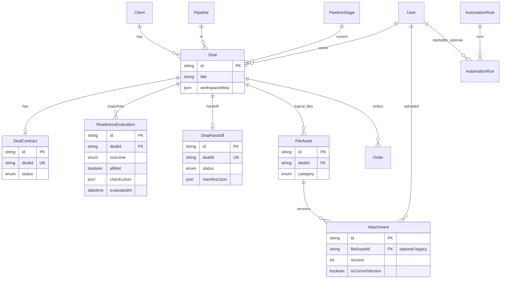

# ERD: ядро угоди та воркспейс

Спрощена схема сутностей, пов’язаних з **Deal workspace**, готовністю до виробництва та файлами. Детальні поля — у `prisma/schema.prisma` та [PRODUCT_SPEC_AI_CRM_MANUFACTURING.md](./PRODUCT_SPEC_AI_CRM_MANUFACTURING.md).

## Потоки даних (коротко)

- **Готовність:** розрахунок у коді (`evaluateReadiness`) за `workspaceMeta`, `DealContract.status` та категоріями `Attachment`. Після змін мети, договору або файлів викликається `persistReadinessSnapshot` → новий рядок `ReadinessEvaluation`.
- **Файли:** нове завантаження створює `FileAsset` і перший `Attachment`; повтор з тим самим `fileAssetId` додає версію (`version++`, попередні `isCurrentVersion = false`).
- **Передача:** `DealHandoff` тримає статус життєвого циклу; прапорець `handoffPackageReady` лишається в `workspaceMeta` для readiness-чекліста.
